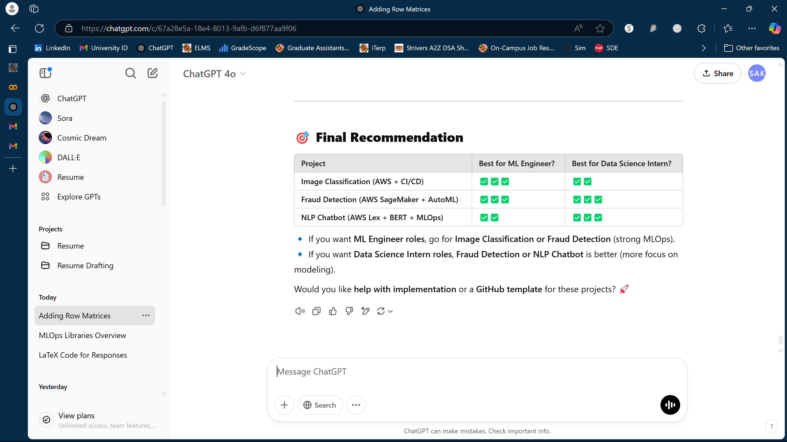
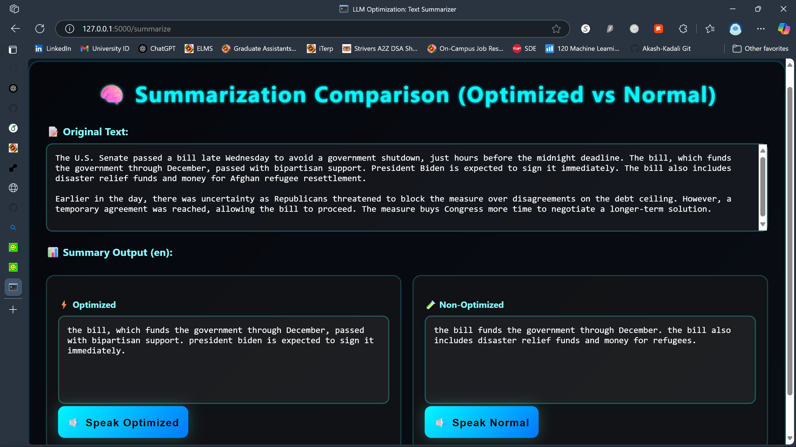

# ⚙️ LLM Optimization Project – 🌐 Text Summarizer Web App (English & Chinese)

Welcome to our **LLM Optimization Project**! This repository contains a lightweight, research-oriented **Flask web application** built to demonstrate how **Large Language Models (LLMs)** like **T5** can be integrated and optimized for **multilingual text summarization**, currently supporting **English** and **Chinese** outputs via Google Translate

---

### 📥 Input (English)



### 📤 Output (English)



### 📥 Input (Chinese)

<!-- Add screenshot or example text here -->

### 📤 Output (Chinese)

<!-- Add screenshot or example text here -->

---

## 🧠 Overview

This app is part of a broader initiative to **optimize LLMs for deployment** on limited-resource environments and to explore multilingual performance. Key components:

* ✅ **Flask**: Web backend framework
* ✅ **T5 Transformer**: Abstractive summarization engine
* ✅ **Google Translate API**: Enables cross-language summarization

The app allows users to input text, choose between English and Chinese, and receive a concise summary in their preferred language. It provides a minimal and modifiable interface for LLM experimentation.

---

## 🔬 LLM Optimization Direction (Coming Soon)

This project is evolving toward:

* 🧪 Hyperparameter tuning using **Katib/Kubeflow**
* 🐳 Containerization with **Docker**
* ☁️ Cloud deployment via **Kubernetes** or **Render**
* ⚡ Experiment tracking and optimization for **latency, memory**, and **quality**

Stay tuned for updates on integrating **low-resource models**, **distillation**, and **quantization** techniques.

---

## ⚙️ Installation

Install required dependencies:

```bash
pip install Flask transformers googletrans==4.0.0-rc1
````

> ⚠️ Ensure you use `googletrans==4.0.0-rc1` to avoid bugs.

---

## 🚀 Local Usage

1. Navigate to the project directory:

```bash
cd Desktop/Text-Summarizer-main
```

2. Run the app:

```bash
python app.py
```

3. Open in browser:

```
http://localhost:5000
```

4. Enter your text, choose a language (English/Chinese), and click **Summarize**.

---

## 🙏 Acknowledgments

* 🤖 [T5 Model](https://huggingface.co/t5-small) from Hugging Face
* 🌐 Google Translate API
* 🧪 Flask for backend interface

> ⚠️ The app is in **debug mode**. Please disable it before production deployment.
