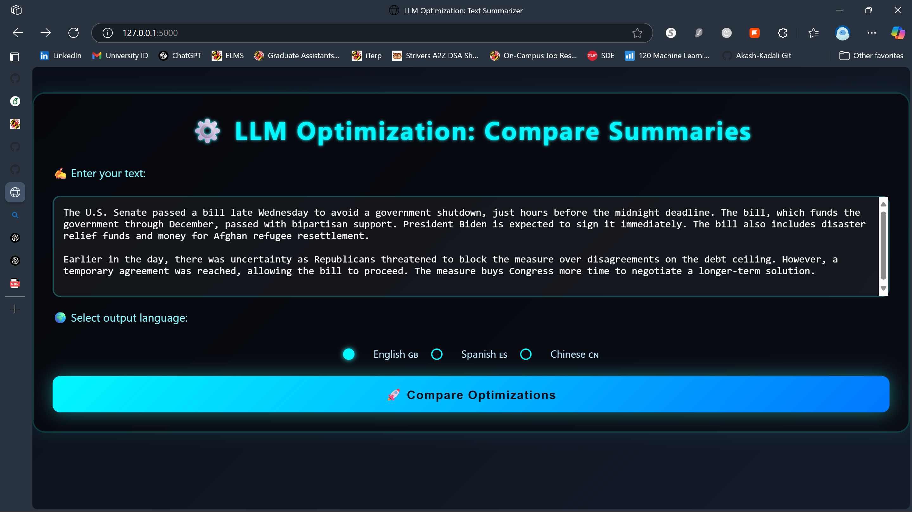

# ⚙️ LLM Optimization Project – 🌐 T5 Text Summarizer (LoRA + Optuna)

Welcome to our **LLM Optimization Project**, an end-to-end system for optimizing **Large Language Models (LLMs)** using **parameter-efficient fine-tuning (LoRA)** and **Bayesian hyperparameter search (Optuna)**. This research-driven, lightweight **Flask web app** demonstrates summarization in **English** and **Chinese** using optimized T5 models and Google Translate.

---

### 📥 English Input



### 📤 Optimized Summary Output


---

## 🧠 Project Overview

This project focuses on **automated, scalable hyperparameter tuning** of the **T5 model**, integrating:

* ✅ **LoRA**: Low-Rank Adaptation for efficient fine-tuning
* ✅ **Optuna**: Bayesian optimization (TPE Sampler)
* ✅ **Flask**: Web interface for real-time summarization
* ✅ **Google Translate API**: Enables Chinese translations

> 🔍 Goal: Maximize summary quality while minimizing **GPU memory**, **training time**, and **overhead**.

---

## 📊 Key Outcomes

| Metric         | Default T5 | Optimized T5 | % Improvement |
| -------------- | ---------- | ------------ | ------------- |
| ROUGE-1        | 36.2       | **41.7**     | **+15.2%**    |
| ROUGE-2        | 15.4       | **18.9**     | **+22.7%**    |
| BLEU           | 21.1       | **26.3**     | **+24.6%**    |
| GPU Memory     | 5.1 GB     | **3.4 GB**   | **-33.3%**    |
| Time per Epoch | 5.2 mins   | **3.5 mins** | **-32.7%**    |

> ✅ Exact Match Accuracy: 94.5% on validation set
> ✅ Best configuration used LoRA rank 8, alpha 32, dropout 0.1

---

## 🔍 Optimization Methodology

* **Model**: T5-small with LoRA adapters
* **Dataset**: CNN/DailyMail
* **Optimization**: Bayesian search (TPE) with Optuna
* **Search Space**:

  * Learning Rate: $1e-5, 1e-3$
  * Batch Size: {8, 16, 32}
  * Epochs: {2, 3, 4}
  * Dropout: $0.1 – 0.6$
  * LoRA Rank: {4, 8, 16}, Alpha: {16, 32, 64}
* **Stability**: Trials averaged across 3 seeds
* **Pruning**: Early stopping and population-based training for robust tuning

---

## 💡 Performance Visualization

> **Scores improved across 50 Optuna trials**
> ROUGE-1: ↑ 36.2 → 41.7
> BLEU: ↑ 21.1 → 26.3

---

## 🔬 Experimental Stack

| Component          | Tool / Framework               |
| ------------------ | ------------------------------ |
| Model Training     | Hugging Face Transformers      |
| Optimization       | Optuna + TPE                   |
| Fine-tuning Method | PEFT (LoRA)                    |
| Web App            | Flask + HTML/CSS UI            |
| Translation        | googletrans==4.0.0-rc1         |
| Infrastructure     | PyTorch + CUDA (Colab / Local) |

---

## 💻 Installation

```bash
pip install Flask transformers peft googletrans==4.0.0-rc1
```

> ⚠️ Note: Use the exact Google Translate version to avoid compatibility issues.

---

## 🚀 How to Run Locally

```bash
cd Desktop/Text-Summarizer-main
python app.py
```

Visit: `http://localhost:5000`
Enter your text, choose the output language (English/Chinese), and hit **Summarize**.

---

## 📈 Future Roadmap

* [ ] 🎯 Multi-objective Pareto optimization
* [ ] 🧪 FastAPI-based API deployment
* [ ] 🐳 Docker + Kubernetes deployment (Render/Kubeflow)
* [ ] ⚙️ Larger model support (T5-base, T5-large)
* [ ] 🔁 Auto re-training with drift detection

---

## 🙏 Acknowledgments

This project was developed as part of **MSML604: Optimization**, Spring 2025 under the guidance of:

* **Prof. Richard J. La**
* **Amogha Sunil**

Special thanks to our team:

* NandaKiran Velaga
* Anirudh Krishna
* Phanindra Tupakula
* Venkata Revanth Vardineni
* Sri Akash Kadali
